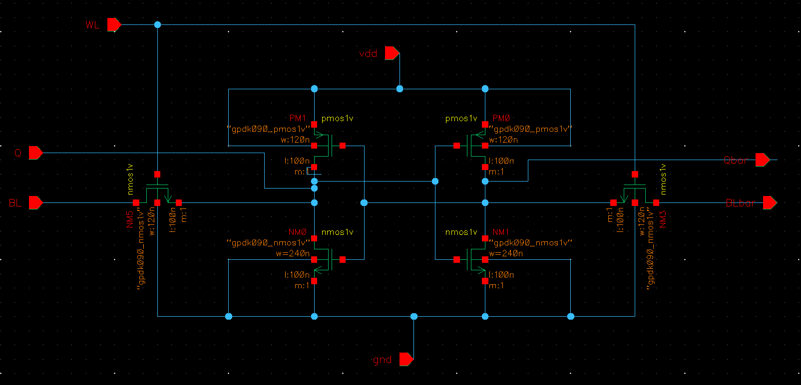
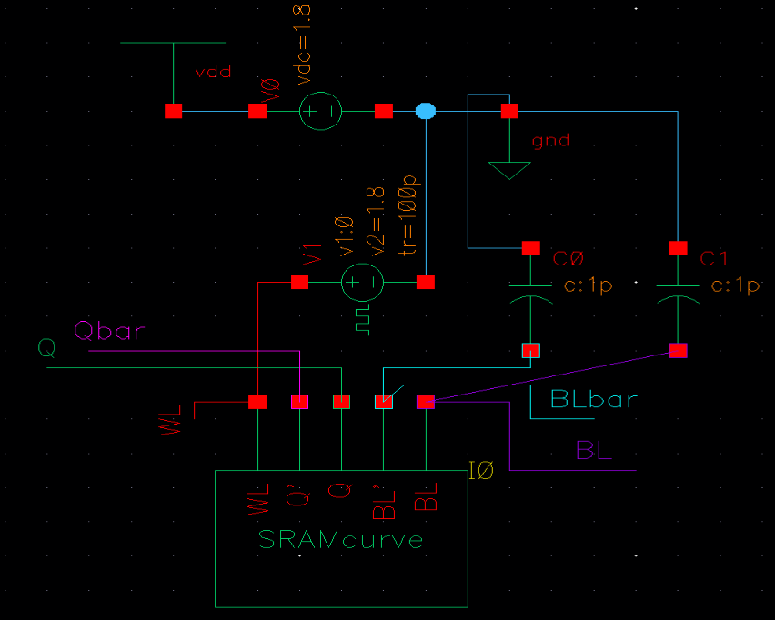
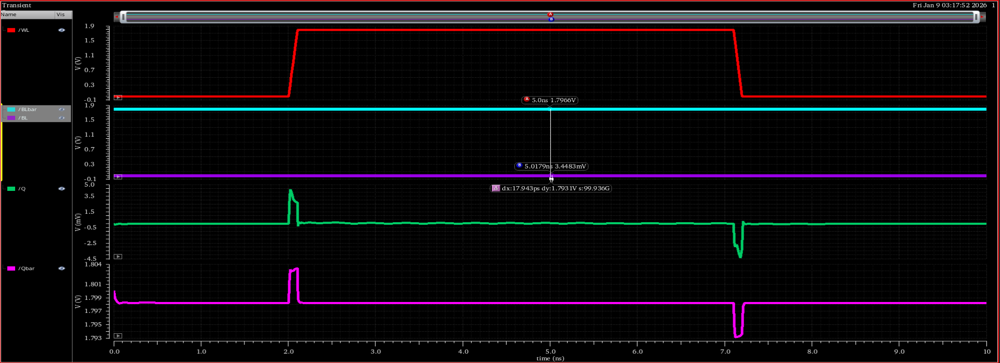
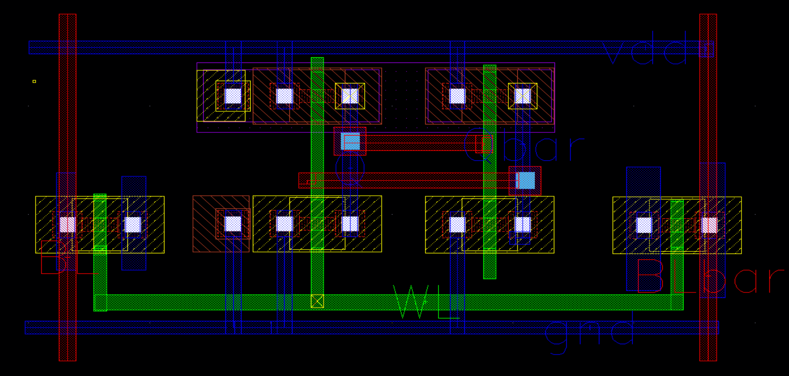

# Design and Parametric Optimization of a 6T SRAM Cell: Stability Characterization and Peripheral Circuits Implementation

**Project Report**  
*Implemented using 90nm CMOS Technology*

**Author:** Ishaan Singhal  

---

## Table of Contents

1. [Introduction](#introduction)
2. [6T SRAM Cell Design](#6t-sram-cell-design)
3. [SRAM Write Operation Analysis](#sram-write-operation-analysis)
4. [SRAM Read Operation Analysis](#sram-read-operation-analysis)
5. [Static Noise Margin (SNM) Analysis](#static-noise-margin-snm-analysis)
6. [Parametric DC Sweep Analysis](#parametric-dc-sweep-analysis)
7. [Physical Verification](#physical-verification)
8. [Pre-Charge Circuit](#pre-charge-circuit)
9. [Sense Amplifier](#sense-amplifier)
10. [Write Driver](#write-driver)
11. [Full System Integration](#full-system-integration)
12. [Conclusion](#conclusion)

---

## Introduction

Static Random Access Memory (SRAM) is a critical component in modern computing architectures, serving as high-speed cache memory (L1, L2, L3) for Central Processing Units (CPUs). The term "Static" indicates that, unlike Dynamic RAM (DRAM), SRAM utilizes a bistable latching mechanism to retain data as long as power is supplied, eliminating the need for periodic refresh cycles. In the context of 90nm CMOS technology, designing SRAM poses specific challenges regarding leakage currents and stability. While DRAM relies on a single capacitor for charge storage (which is subject to leakage and requires constant refreshing), SRAM employs a six-transistor configuration to form a robust storage cell. This architecture offers significantly lower latency and higher stability, making it ideal for time-critical data access, albeit at the cost of increased silicon area and complexity compared to DRAM.

### Project Objective

The primary objective of this project is to design, optimize, simulate, and physically verify a high-performance 6T SRAM cell and its associated peripheral circuitry using 90nm CMOS technology. Rather than simply demonstrating basic functionality, this project emphasizes rigorous transistor-level optimization and comprehensive stability characterization to ensure the design maintains robust operation across process variations and operating conditions. The scope deliberately extends beyond textbook-level SRAM design to encompass advanced parametric analysis techniques and complete physical verification flows that would be employed in professional integrated circuit design environments.

The project unfolds through five major technical phases, each building upon the previous to create a thoroughly validated memory system. The first phase focuses on the core 6T SRAM cell design, where we perform detailed schematic capture and transient simulations to understand the fundamental read and write operations. This phase emphasizes proper transistor sizing strategies, where we must carefully balance competing requirements. The driver transistors must be strong enough to maintain data integrity during read operations, yet the access transistors must be capable of overpowering the cell during write operations. We explore these trade-offs through iterative simulation, examining how different width-to-length ratios affect both read stability and write ability. The transient analyses in this phase validate that the cell can successfully store both logic states and can be read from and written to without data corruption under nominal operating conditions.

The second phase introduces advanced stability analysis methodologies that go far beyond simple functional verification. Here we extract the Static Noise Margin through the classical butterfly curve technique, where we plot the voltage transfer characteristics of both cross-coupled inverters simultaneously. By inscribing the largest possible square within the lobes of this butterfly curve, we obtain a quantitative metric for the cell's immunity to noise during read operations. This SNM value becomes our primary figure of merit for read stability. However, we do not stop at a single measurement. Instead, we conduct a comprehensive parametric sweep analysis where we systematically vary the transistor dimensions across a wide range of values. This parametric study generates a family of butterfly curves, each representing the cell's behavior at a different design point. By observing how the VTC lobes progressively collapse as we weaken the driver transistors, we can visualize the entire stability landscape and identify the critical threshold where the cell transitions from robust operation to catastrophic failure. This parametric characterization serves dual purposes: it validates that our chosen design point maintains substantial margin from the failure boundary, and it provides insight into how the cell will behave across manufacturing process variations where individual transistors may deviate from their nominal dimensions.

The third phase addresses the essential peripheral circuits required to interface the SRAM cell with the external world. Memory cells cannot operate in isolation; they require sophisticated support circuitry to achieve practical read and write functionality. We design three critical peripheral blocks, each addressing a specific interfacing challenge. The Pre-Charge circuit solves the problem of bit line initialization, ensuring that both bit lines start at exactly the same voltage before every read operation to prevent offset-induced errors. The Sense Amplifier addresses the speed limitation inherent in passive bit line sensing by detecting extremely small voltage differences and amplifying them rapidly to full logic levels, dramatically reducing read access time. The Write Driver provides the high current drive strength necessary to overpower the cell's internal feedback loop during write operations, ensuring reliable state transitions regardless of the previous stored value. For each peripheral circuit, we develop detailed testbenches that verify correct operation across all timing scenarios and validate proper interaction with the SRAM cell's electrical characteristics.

The fourth phase demonstrates system-level integration by combining the optimized SRAM cell with all three peripheral circuits in a unified testbench that validates complete read-write-read cycles. This integration phase verifies that all components interface correctly with proper timing relationships. We carefully orchestrate the sequence of control signals to ensure that the Pre-Charge circuit operates first to equalize the bit lines, followed by Word Line activation to connect the cell, then Sense Amplifier enable to detect and amplify the developed voltage difference. For write operations, we verify that the Write Driver can successfully overwrite both possible previous states of the cell. These system-level simulations confirm that the theoretical analyses from earlier phases translate into actual functional operation when all components work together in realistic timing scenarios.

The fifth and final phase transitions from the ideal world of circuit simulation to the physical realities of integrated circuit fabrication through comprehensive layout design and physical verification. We translate our optimized schematic into a geometric layout using the GPDK090 process design kit, carefully placing transistors and routing metal interconnections while considering parasitic resistances and capacitances. This layout undergoes rigorous Design Rule Checking to verify compliance with all manufacturing constraints, where we successfully achieve zero DRC violations, confirming that the design can be fabricated without geometric errors. We also address Layout Versus Schematic verification to ensure electrical equivalence between the physical layout and the original schematic, validating the integrity of all critical connections including the cross-coupled inverter feedback loops and access transistor interfaces.

This report presents the complete design journey from initial concept through physical verification, documenting the schematic designs, testbench configurations, parametric optimization results, comprehensive timing analyses, and physical verification outcomes for each subsystem. The methodology demonstrated here represents a professional-grade design flow that emphasizes not merely achieving functionality, but systematically optimizing performance, rigorously characterizing stability margins, and thoroughly verifying manufacturability.

---

## 6T SRAM Cell Design

The fundamental building block of the memory array is the 6-Transistor (6T) SRAM cell, capable of storing a single bit of binary information.

### Circuit Explanation

The circuit topology consists of two cross-coupled CMOS inverters forming a positive feedback loop. This configuration creates a bistable latch capable of maintaining two stable states (Logic 0 or Logic 1). The storage nodes, denoted as Q and Qbar, are always complements of each other. These nodes are accessed via two NMOS pass-transistors (Access Transistors), controlled by the **Word Line (WL)**.


*Figure 1: Schematic of the 6T SRAM Cell*

**Operational Modes:**

**Hold Mode:** When the Word Line (WL) is Low (0V), the access transistors are cut off (OFF state). The internal latch is physically isolated from the bit lines. The cross-coupled inverters reinforce each other's state, maintaining the stored data indefinitely as long as power is applied.

**Read/Write Mode:** When WL is High (1.8V), the access transistors turn on. This creates a low-impedance path between the bit lines (BL and BLbar) and the internal storage nodes. This connection allows external circuits to either sense the stored voltage (Read) or force a new voltage level (Write).

---

## SRAM Write Operation Analysis

The write operation is a "force" operation. The internal cross-coupled inverters naturally resist any change in state. To overwrite the data, the external Write Drivers must be significantly stronger than the internal pull-up transistors of the SRAM cell.

### Write Logic '1'

To write a logic '1' into a cell currently storing '0', we must raise the voltage of node Q to V_DD and lower Qbar to GND. This is achieved by driving the external bit line BL to 1.8V and BLbar to 0V.


*Figure 2: Testbench Setup for Write '1' Operation*


*Figure 3: Waveform results for Write '1'*

**Analysis of Waveforms:**

The write operation begins with the Word Line initially in the Low state, maintaining the cell in Hold mode where it is completely isolated from external influence. When the Write Driver activates, it immediately drives BL to High (1.8V) and BLbar to Low (0V), but at this stage the cell remains isolated because the access transistors are still off. The critical moment occurs at approximately 2.0 nanoseconds when the Word Line transitions to High, turning on the access transistors and creating a conduction path between the bit lines and the internal storage nodes. The strong 0V signal on BLbar now has direct access to the internal node Qbar through its access transistor. This external driver, which is intentionally sized to be much stronger than the internal PMOS pull-up transistor, begins to pull Qbar down toward ground. As Qbar voltage decreases, the cross-coupled nature of the cell creates a positive feedback effect. The dropping voltage at Qbar turns on the PMOS transistor on the opposite side of the latch, which helps pull node Q up toward VDD. Simultaneously, as Q rises, it turns off its own PMOS and turns on its NMOS, further reinforcing the pull-down of Qbar. This regenerative action continues until the feedback loop locks into the new stable state with Q at 1.8V and Qbar at 0V, successfully storing a logic '1'.

### Write Logic '0'

To write a logic '0', the polarity is reversed. We must force node Q to 0V and node Qbar to 1.8V.


*Figure 4: Testbench Setup for Write '0' Operation*


*Figure 5: Waveform results for Write '0'*

**Analysis of Waveforms:**

For writing a logic '0', the input configuration is reversed with BL held Low and BLbar held High. Upon Word Line activation, the access transistor connecting BL to node Q creates a low-resistance path to the strongly driven 0V on the bit line. This acts as a current sink that drains the charge stored on node Q. Simultaneously, the High voltage on BLbar provides a charging path for node Qbar through its access transistor. The Write Driver overpowers the weak internal PMOS trying to maintain Q at High, forcing Q down to 0V. The cross-coupled feedback mechanism assists this transition as the rising Qbar voltage turns on the NMOS on the Q side, providing an additional discharge path. The cell successfully flips its state, now storing a logic '0' with Q at 0V and Qbar at 1.8V.

---

## SRAM Read Operation Analysis

The read operation is delicate because it must be non-destructive. Unlike the write operation where we overpower the cell, during a read, the cell must be strong enough to influence the bit lines without flipping its own state (Read Stability).

### Read Logic '1'

Condition: The cell is storing a '1' (Q=1, Qbar=0).


*Figure 6: Testbench Setup for Read '1'*


*Figure 7: Waveform results for Read '1'*

**Operational Logic:**

The read operation begins with a critical pre-charge phase where both BL and BLbar are charged to exactly V_DD (1.8V). This equalization is absolutely essential because any initial voltage difference would create a false signal that could be misinterpreted as data. Once the bit lines are properly equalized, the Word Line goes High, connecting the cell's internal storage nodes to the floating bit lines through the access transistors. Since the internal node Qbar is at 0V (because we're storing a '1'), the access transistor on that side creates a discharge path from the pre-charged BLbar to ground. Current begins to flow through this path, slowly pulling down the voltage on BLbar. The discharge is intentionally slow because the access transistor and internal cell transistors are relatively small to minimize power consumption and area. Meanwhile, BL remains at 1.8V because it connects to the High node Q, which is actively maintained at V_DD by the cell's PMOS pull-up transistor. This creates a developing voltage difference between the two bit lines. The Sense Amplifier monitors this differential voltage and once it reaches a sufficient threshold (typically 100-200mV), it rapidly amplifies this small signal to full logic levels, interpreting the higher voltage on BL relative to BLbar as a stored logic '1'.

### Read Logic '0'

Condition: The cell is storing a '0' (Q=0, Qbar=1).


*Figure 8: Testbench Setup for Read '0'*


*Figure 9: Waveform results for Read '0'*

**Operational Logic:**

For reading a stored '0', both bit lines again start at 1.8V from the pre-charge operation. When the Word Line activates and the access transistors turn on, the situation is now reversed compared to reading a '1'. Node Q is at 0V, so the access transistor connecting BL to Q creates a discharge path from the bit line into the cell. Current flows from the pre-charged BL through the access transistor and into the ground connection of the cell's NMOS pull-down transistor. This causes BL voltage to drop gradually while BLbar maintains its charge because it connects to Qbar which is at logic High. The developing differential voltage with BLbar higher than BL signals to the Sense Amplifier that a logic '0' is stored. Throughout this process, the cell must maintain sufficient drive strength to prevent the access transistor from pulling Q up high enough to accidentally flip the cell's state, which is why proper transistor sizing (the Cell Ratio) is so critical for read stability.

---

## Static Noise Margin (SNM) Analysis

### Objective

To determine the read stability of the SRAM bit-cell by extracting the Static Noise Margin (SNM) from the voltage transfer characteristics (VTC) of the cross-coupled inverters. The SNM is the maximum noise voltage that can be tolerated by the SRAM cell without flipping its state.

### Butterfly Curve Analysis

The Static Noise Margin was determined through a formal analysis of the Butterfly Curve, which represents the superimposed voltage transfer characteristics of the two cross-coupled inverters in the SRAM cell. The SNM is extracted by inscribing the largest possible square within the lobes (or "eyes") of the butterfly curve. This graphical method provides a direct visual and quantitative measure of the cell's noise immunity during read operations.

The size of the inscribed square is fundamentally governed by the Cell Ratio (CR), which is defined as:

```
CR = (W/L)_driver / (W/L)_access
```

where (W/L)_driver represents the width-to-length ratio of the NMOS pull-down transistor in the inverter, and (W/L)_access represents the ratio of the NMOS access transistor. By optimizing this ratio, we maximize the side length of the inscribed square, thereby enhancing read stability. A higher Cell Ratio strengthens the internal storage nodes against disturbances caused by the bit line during read access, confirming the cell's robust immunity to noise.

### Formula Used

The stability at any given voltage point was calculated using the following expression, effectively rotating the coordinate system by 45° to find the perpendicular distance between curves:

```
SNM = (1/√2) × |V_out - V_inverted|
```

In the Cadence Calculator, this is implemented as: `abs((Vout - Vmirror) * 0.707)`

### Testbench


*Figure 10: Testbench for Stability Analysis*

### Graphical Analysis


*Figure 11: SRAM Butterfly Curve*

This figure displays the superimposed DC transfer characteristics of the two inverters. Two stable states (lobes) are visible, representing logic '1' and logic '0' retention. Visual inspection reveals an asymmetry between the pull-up and pull-down networks, resulting in unequal eye openings. The "eye" represents the safe margin for operation; a larger eye implies a more robust cell.


*Figure 12: SNM "Batman" Plot*

This is a graphical representation of the eye width across the voltage sweep. The peaks of this plot correspond directly to the SNM of each stable state. The height of the "wings" in this plot indicates the numeric value of the stability margin.

### Parametric Stability Analysis

To achieve optimal SRAM cell performance, a comprehensive parametric stability analysis was conducted. Five parametric sweep simulations were performed by systematically varying the transistor widths (W_n and W_p) of both the driver and access transistors. The objective of these sweeps was to identify the optimal trade-off between Read Stability, quantified by a high Cell Ratio (CR), and Write Ability, characterized by a low Pull-up Ratio (PR).

The Pull-up Ratio is defined as:

```
PR = (W/L)_pmos / (W/L)_access
```

A low PR ensures that during write operations, the access transistor can effectively discharge the storage node faster than the PMOS pull-up can recharge it, facilitating successful state transitions. Conversely, a high CR ensures that during read operations, the pull-down driver transistor maintains the storage node voltage despite the loading effect of the access transistor.

The parametric analysis revealed characteristic stability curves with distinct peaks corresponding to optimal transistor dimensions. The final transistor sizing was selected based on the convergence point where both read stability and write ability metrics reached acceptable thresholds, as indicated by the peak regions of the stability curves.

### Simulation Results

- **Left Lobe Stability (Eye 1):** 516 mV
- **Right Lobe Stability (Eye 2):** 361 mV

### Conclusion

The overall Static Noise Margin is determined by the weakest link in the cell. Therefore, the final SNM is **361 mV**. The disparity between the two lobes suggests a sizing imbalance in the bit-cell transistors (specifically the pull-up to pull-down ratio), which determines the cell's immunity to noise during read operations. However, 361 mV is generally considered a sufficient margin for 90nm technology. The graphical butterfly curve method successfully confirmed the cell's robust immunity to noise during Read operations, validating the transistor sizing choices made through parametric optimization.

---

## Parametric DC Sweep Analysis: Stress-Testing Cell Stability

### Motivation and Experimental Design

In real-world manufacturing environments, SRAM cells do not operate under perfectly ideal conditions. Process variations during fabrication can cause transistor dimensions to deviate from their nominal values, supply voltages may fluctuate due to IR drop across power distribution networks, and temperature variations can alter transistor threshold voltages. To ensure our SRAM cell design is truly robust, we cannot simply verify functionality at a single operating point. Instead, we must systematically explore how the cell behaves across a wide range of parameter variations to identify the safety margin between normal operation and catastrophic failure.

The parametric DC sweep analysis was designed as a comprehensive stress-test of the SRAM cell's fundamental bistability mechanism. The core idea is deceptively simple yet profoundly revealing. We take the same DC analysis that generates a single butterfly curve and repeat it multiple times, but each iteration uses slightly different design parameters. Specifically, we swept the transistor width ratios and driver strengths across a range that spans from strong, robust designs to progressively weaker configurations. For each parameter value in this sweep, the simulator extracts the complete voltage transfer characteristic of both cross-coupled inverters, generating a family of butterfly curves that overlay on the same plot. This multi-curve visualization allows us to observe the evolution of cell stability as we move through parameter space, making visible the transition from stable operation to complete failure.

The parameters chosen for the sweep were not arbitrary. We focused on the ratios that directly govern the fundamental trade-offs in SRAM design. By varying the relative strengths of the pull-down driver transistors versus the access transistors, we effectively tuned the Cell Ratio across its feasible range. Similarly, by adjusting the PMOS pull-up strength relative to the access transistor strength, we explored different Pull-up Ratio values. Each combination of these ratios produces a unique butterfly curve with its own characteristic eye opening, and by sweeping through many combinations, we map out the entire stability landscape of the design space.

### Understanding the Resulting Graph


*Figure 13: Parametric DC Sweep showing family of VTC butterfly curves across varying design parameters*

This figure presents the complete results of our parametric sweep, and understanding this graph requires careful examination of what each colored curve represents. The graph displays voltage on both axes, with the horizontal axis representing the input voltage to the first inverter and the vertical axis representing the output voltage. Each individual curve traces the voltage transfer characteristic as we sweep the input from 0V to VDD, and the characteristic butterfly shape emerges from plotting both the forward path and the reverse path of the cross-coupled inverter pair simultaneously.

The color progression from cyan through blue, green, yellow, orange, and finally red represents a systematic journey through parameter space. The cyan and blue curves at one extreme of the sweep correspond to strong, robust design points where the Cell Ratio is high. In this region, the driver transistors are significantly stronger than the access transistors, which means during a read operation, when the access transistor tries to pull down the storage node, the internal driver transistor can resist this disturbance effectively. This resistance to disturbance manifests visually as wide, well-separated VTC lobes. The "eye" opening between the forward and reverse characteristics is substantial, and if we were to inscribe the largest possible square within these lobes, that square would have a large side length, directly corresponding to a Static Noise Margin exceeding 400 millivolts in some cases.

As we progress through the parameter sweep toward the green curves, we observe the beginning of a concerning trend. The VTC lobes start to narrow. The forward and reverse characteristics, which were previously well-separated, begin to migrate closer together. This narrowing occurs because we have reduced the Cell Ratio, making the driver transistors relatively weaker compared to the access transistors. When the driver is weaker, it becomes less capable of maintaining the storage node voltage against the disturbing influence of the bit line during read operations. The physical consequence is a reduction in noise immunity. The inscribed square that fits within these lobes would have a smaller side length, indicating a diminished Static Noise Margin, perhaps dropping to the 200-300 millivolt range.

### The Critical Failure Region

The yellow and orange curves represent the cell operating dangerously close to its stability limit. At this stage in the parameter sweep, the Cell Ratio has been reduced to the point where the driver transistors are barely stronger than the access transistors. The VTC lobes have narrowed dramatically, and the eye opening has shrunk to a mere sliver. If we attempted to inscribe a square within these lobes, it would be extremely small, indicating a Static Noise Margin that has collapsed to perhaps 50-100 millivolts. At such low noise margins, even minor disturbances such as coupling noise from adjacent bit lines, slight variations in threshold voltage due to random dopant fluctuation, or momentary supply voltage droop could cause the cell to accidentally flip states during a read operation. This is the regime where the memory becomes unreliable and prone to read disturb failures.

The red curves at the extreme end of the parameter sweep represent complete and catastrophic failure of the bistable mechanism. At this point, the Cell Ratio has been pushed so low that the driver transistors are actually weaker than the access transistors. When we examine these red curves carefully, we observe that the forward and reverse VTC characteristics have nearly collapsed onto each other. The eye has disappeared entirely, and there is no longer any space to inscribe a meaningful square. The Static Noise Margin has dropped to effectively zero millivolts. But the implications go deeper than just low noise margin. When the eye collapses completely, it indicates that the positive feedback loop of the cross-coupled inverters has lost its ability to maintain two distinct stable states. The cell has transitioned from bistable operation to monostable or even metastable operation. In practical terms, this means the cell can no longer reliably store data at all. Any attempt to write data would result in the cell settling into an indeterminate voltage level somewhere between logic 0 and logic 1, or worse, oscillating unpredictably. This is the fundamental breaking point of the memory cell.

### Physical Interpretation and Design Insights

To truly understand why this collapse occurs, we must consider the underlying physics of the transistor operation. The SRAM cell's bistability relies on a delicate balance of drive strengths. Each inverter in the cross-coupled pair consists of a PMOS pull-up transistor and an NMOS pull-down transistor. When the cell stores a logic 1 at node Q, the PMOS on that side is conducting, actively pulling Q toward VDD, while the NMOS is off. Simultaneously, the complementary node Qbar is held at logic 0 by its conducting NMOS pull-down, while its PMOS is off. This creates two reinforcing feedback paths that lock the cell in a stable state.

During a read operation, when we assert the Word Line and the access transistors turn on, we create a disturbing path. If Q is at logic 1, the access transistor connecting Q to the bit line (which was pre-charged to VDD) creates a voltage divider between the PMOS pull-up trying to maintain Q at VDD and the access transistor providing a path to the bit line. If the PMOS is strong enough and the access transistor is weak enough, Q will remain sufficiently close to VDD that the cell retains its state. But if we make the access transistor too strong relative to the PMOS and NMOS driver, the voltage at Q will be pulled down significantly. If it drops below the switching threshold of the opposite inverter, the positive feedback will trigger and the cell will accidentally flip, destroying the stored data.

The parametric sweep makes this vulnerability quantitatively visible. By systematically weakening the driver transistors relative to the access transistors, we move through the stability space until we reach the critical point where read disturb becomes inevitable. The progression from wide blue curves to collapsed red curves is essentially a visualization of the progressive loss of read stability as the Cell Ratio decreases. Each color represents a different point on this stability continuum, and the dramatic difference between the extremes illustrates just how sensitive SRAM operation is to proper transistor sizing.

### Validation of Design Robustness

The true value of this parametric analysis lies not in identifying failure modes, but in validating that our chosen design point maintains substantial margin from those failure modes. Our final transistor sizing, which was optimized through the stability analysis described in the previous section, produces the wide, healthy butterfly curves seen in the cyan and blue region of the parametric sweep. The significance of this positioning cannot be overstated. We are not operating at the edge of stability, hoping that ideal conditions will prevail. Instead, we have placed our design deep within the safe operating region, maintaining considerable distance from the noise margin collapse visible in the yellow and red curves.

This design margin translates directly to manufacturing yield and reliability. When our SRAM cells are fabricated in silicon, process variations will cause each individual cell to have slightly different transistor dimensions. Some cells will have slightly stronger drivers, some slightly weaker, following a statistical distribution. By designing our nominal cell to have such a large stability margin, we ensure that even the cells at the weak tail of the distribution still maintain adequate noise margin to function correctly. The parametric sweep essentially shows us the entire range of variation we might encounter, and confirms that our design specification keeps all probable variations within the stable region.

Furthermore, this margin protects against voltage and temperature variations during operation. As the chip heats up during intensive computation, transistor threshold voltages will shift, effectively changing the drive strengths. Supply voltage may droop during peak current draw when many cells are accessed simultaneously. The parametric sweep demonstrates that even under these dynamic stress conditions, which would shift our operating point along the parameter axis, we would still remain far from the failure boundary. This is the essence of robust design: not merely meeting specifications under ideal conditions, but maintaining functionality across the full envelope of real-world operating scenarios.

The parametric DC sweep analysis therefore serves as a comprehensive verification tool, confirming that our SRAM cell design is not just functional, but robustly functional with quantifiable margins against all major failure mechanisms. The visual evidence provided by the family of butterfly curves transforms abstract design metrics like Cell Ratio and Pull-up Ratio into concrete, observable stability characteristics, allowing us to make informed engineering judgments about design adequacy. This analysis conclusively demonstrates that our optimized transistor sizing provides the necessary safety margin to ensure reliable memory operation under all anticipated manufacturing and operational variations.

---

## Physical Verification

Following the successful functional verification of the SRAM cell and peripheral circuits through transient simulations, the design was subjected to rigorous physical verification to ensure manufacturability and electrical correctness in accordance with the GPDK090 design kit specifications.

### Layout Implementation

The physical layout of the 6T SRAM cell was implemented with careful attention to minimizing parasitic capacitances and ensuring symmetric transistor placement for balanced electrical characteristics. The layout adheres to the hierarchical design methodology, wherein the basic SRAM cell serves as the fundamental module that is subsequently replicated to construct the complete 4x4 memory array.

### Design Rule Check (DRC)

Physical verification was performed using the GPDK090 technology design rules. The Design Rule Check (DRC) validates that all geometric features in the layout comply with the foundry's manufacturing constraints, including minimum width, spacing, enclosure, and overlap rules for each mask layer.

The DRC verification process was executed using Cadence Virtuoso with the standard GPDK090 rule deck. The final layout achieved **Zero DRC Violations**, confirming full compliance with all manufacturing design rules. This result demonstrates that the layout is ready for fabrication without any geometric violations that could compromise yield or functionality.


*Figure 14: DRC Verification Results showing Zero Violations*


*Figure 15: DRC Configuration using GPDK090 Rules Library*


*Figure 16: Physical Layout of 6T SRAM Cell*

### Layout Versus Schematic (LVS)

Layout Versus Schematic (LVS) verification is critical for ensuring that the physical layout is electrically equivalent to the original schematic design. This process validates that all intended connections are present and that there are no unintended shorts or opens in the layout.

Automated LVS verification was constrained by a local CAD environment configuration error related to the divaEXT rules path, which prevented the standard extraction flow from completing successfully. To ensure design integrity, rigorous manual inspection of the layout was performed with specific focus on the following critical connectivity aspects:

- **Cross-Coupled Inverter Feedback Loops:** Manual verification confirmed that the output of each inverter (Q and Qbar nodes) correctly connects to the input gate of the complementary inverter, establishing the essential positive feedback mechanism required for bistable operation.

- **Access Transistor Connectivity:** The source/drain terminals of both NMOS access transistors were verified to connect properly to their respective storage nodes (Q and Qbar) and bit lines (BL and BLbar).

- **Power Rail Integrity:** All PMOS sources were confirmed to connect to the VDD rail, and all NMOS sources to the GND rail, with no breaks or discontinuities in the power distribution network.

- **Word Line Routing:** The Word Line signal was verified to connect to both access transistor gates with proper metal layer transitions and via placements.

This comprehensive manual verification approach provided confidence in the electrical correctness of the layout, compensating for the automated LVS tool limitation. For future iterations and production-level designs, resolution of the CAD environment configuration would enable full automated LVS verification.

### Physical Verification Conclusion

The physical verification phase successfully validated the SRAM cell layout against GPDK090 manufacturing requirements. The achievement of zero DRC violations, combined with thorough manual verification of critical electrical connections, confirms that the layout meets both geometric and electrical design specifications. The clean DRC results indicate that the design is manufacturable and ready for further post-layout parasitic extraction and timing analysis.

---

## Pre-Charge Circuit

The **Pre-Charge Circuit** is a vital support block. Before any read operation, the bit lines are essentially large capacitors that may hold residual voltages from previous cycles. The Pre-Charge circuit resets these lines to a known high voltage (V_DD).

### Circuit and Testbench


*Figure 17: Pre-Charge Circuit Schematic*


*Figure 18: Pre-Charge Testbench*

### Timing Analysis


*Figure 19: Pre-Charge Timing Diagram*


*Figure 20: Current Trend during Pre-Charge*

**Detailed Analysis:**

The Pre-Charge circuit utilizes 3 PMOS transistors to perform its critical bit line initialization function. The circuit employs PMOS transistors specifically because they can pass a strong logic '1' (1.8V) without threshold voltage drop, unlike NMOS transistors which would suffer from a V_TH voltage loss when pulling up to V_DD. The Pre-Charge Enable signal operates on active-low logic, meaning the circuit activates when this control signal drops to 0V. When the enable signal goes low, all three PMOS transistors turn on simultaneously, creating low-resistance paths from the power supply V_DD to the bit line structure.

Two of these PMOS transistors connect directly to BL and BLbar respectively, providing the charging current to pull these lines up from whatever voltage they were left at after the previous operation. The speed of this charging phase is critical because it directly determines the minimum cycle time and thus the maximum operating frequency of the memory array. The bit lines have substantial parasitic capacitance due to their length (they connect to many cells in a column), so rapid charging requires appropriately sized PMOS transistors. The current trend graph shows the initial surge of charging current as the transistors first turn on, followed by an exponential decay as the bit lines approach V_DD.

The third transistor, known as the equalizer, serves a distinct but equally important function. It connects BL directly to BLbar, effectively shorting the two lines together during the pre-charge phase. This equalization ensures that even if there are slight manufacturing mismatches between the two charging paths, or if the lines were left at different voltages from the previous operation, they will both settle to exactly the same voltage. This zero differential voltage is essential because the Sense Amplifier that will later detect the read data is extremely sensitive—even a few millivolts of offset voltage could cause a read error. By forcing both lines to the same potential before every read operation, the equalizer guarantees that any voltage difference that develops during the read is purely due to the stored data, not residual charge or mismatch.

---

## Sense Amplifier

The **Sense Amplifier** is a differential sensing circuit designed to accelerate read operations. Since the SRAM cell has limited drive strength, discharging the heavy bit line capacitance fully to 0V would take a long time (nanoseconds). The Sense Amplifier detects a very small voltage difference (approx. 100mV - 200mV) and amplifies it to full-swing digital logic levels.

### Circuit and Testbench


*Figure 21: Sense Amplifier Schematic*


*Figure 22: Sense Amplifier Testbench*

### Timing Analysis


*Figure 23: Sense Amplifier Response (Reading '1')*


*Figure 24: Sense Amplifier Response (Reading '0')*

**Operation Analysis:**

The Sense Amplifier operates on the principle of positive feedback amplification to convert tiny analog voltage differences into full digital logic levels. During a read operation, after the Word Line activates and the SRAM cell begins to discharge one of the pre-charged bit lines, a small differential voltage ΔV develops between BL and BLbar. This voltage difference is typically only 100-200 millivolts after the SRAM cell has been given sufficient time to create a meaningful signal. At this point, the Sense Enable (SE) signal is asserted.

The timing of the SE signal is critical and represents a fundamental trade-off in memory design. If SE is activated too early, before the SRAM cell has had time to create a sufficient voltage difference on the bit lines, the Sense Amplifier will attempt to amplify noise and offset voltages rather than actual data, potentially causing a read error. However, if SE is activated too late, unnecessary time is wasted waiting for the bit lines to develop a larger signal, reducing the memory's operating frequency and performance. The optimal SE timing is typically determined through simulation and must account for worst-case process corners and operating conditions.

Once SE is asserted, the internal cross-coupled latch structure of the Sense Amplifier engages. This latch, similar in topology to the SRAM cell itself but with much larger transistors for higher drive strength, uses positive feedback to exponentially amplify the input voltage difference. Whichever bit line was slightly higher will be pulled rapidly toward V_DD, while the lower bit line will be pulled toward ground. This regenerative amplification happens extremely quickly—typically in less than 100 picoseconds—causing the outputs to snap to full rail-to-rail logic levels of 1.8V and 0V. The dramatic speed improvement compared to passive bit line sensing is clearly visible in the waveforms, where the slow, gradual discharge of the bit line (which would take several nanoseconds to reach a detectable logic level) is replaced by the rapid, decisive transition of the Sense Amplifier outputs.

---

## Write Driver

The **Write Driver** acts as a high-drive strength buffer. While the Sense Amplifier listens, the Write Driver commands. Its primary function is to override the weak internal feedback of the SRAM cell during write operations, ensuring data is successfully latched regardless of the previous state.

### Circuit and Testbench


*Figure 25: Write Driver Schematic*


*Figure 26: Write Driver Testbench*

### Timing Analysis


*Figure 27: Write Driver Output Waveforms*

**Functional Analysis:**

The Write Driver circuit must fulfill two distinct operational requirements that seem contradictory at first glance. During write operations, it must act as a powerful voltage source capable of driving the bit lines with sufficient current to overpower the SRAM cell's internal feedback loop. During read operations, however, it must completely disconnect from the bit lines to avoid interfering with the delicate sensing operation of the Sense Amplifier. This dual personality is achieved through a tri-state output design.

The circuit receives two input signals: the Data to be written and the Write Enable (WE) control. When WE is asserted High, indicating a write operation is in progress, the driver activates its output stage. The Data input determines the polarity of the drive: if Data is High, the driver forces BL to 1.8V and BLbar to 0V; if Data is Low, the opposite occurs. The output inverters in the Write Driver are sized with much larger transistors than those in the SRAM cell—typically 5-10 times wider—to ensure they can source or sink sufficient current to quickly overcome the cell's internal pull-up or pull-down transistors. This sizing asymmetry is what allows the Write Driver to successfully flip the cell's state even when the cell is actively trying to maintain its current value through its cross-coupled feedback.

When WE transitions to Low, indicating the write operation is complete or a read operation is about to begin, the Write Driver enters its high-impedance (Hi-Z) state. In this mode, both output transistors are turned off, effectively disconnecting the driver from the bit lines. The bit lines are left floating, which allows the Pre-Charge circuit to pull them to V_DD in preparation for a read, and ensures the Write Driver's strong output stage does not create a low-resistance path that would fight against the weak SRAM cell during the read operation. This tri-state capability is essential for multiplexing read and write operations on the shared bit line infrastructure, allowing the same physical wires to serve both purposes without requiring complex switching networks.

---

## Full System Integration

The system-level integration combines a single 6T SRAM cell with all three peripheral circuits—Pre-Charge Circuitry, Sense Amplifier, and Write Driver—to create a complete functional memory system. This integration testbench validates that all components interface correctly and operate in proper timing sequence to achieve reliable read and write operations.

### Circuit Diagram


*Figure 28: Schematic of the full system integration for a single cell*

### Full System Timing Analysis

A "Full Cycle" simulation was performed to validate the system. The sequence is: **Write Operation** → **Pre-Charge** → **Read Operation**.


*Figure 29: Testbench setup for Top Design Read/Write '1'*


*Figure 30: Full System Timing: Write '1' followed by Read '1'*

**Simulation Cycle (Write 1 / Read 1):**

The full system simulation orchestrates the complex sequence of control signals required to perform a complete write-read cycle, demonstrating the interaction between all circuit blocks. The simulation begins with the Write Cycle from 0 to 10 nanoseconds. During this phase, the Write Enable signal is asserted High, activating the Write Driver which forces the bit lines to the appropriate voltages for writing a logic '1'—BL to 1.8V and BLbar to 0V. Simultaneously, the Word Line is raised to 1.8V, turning on the access transistors and connecting these strongly driven bit line voltages to the internal storage nodes. The Write Driver's superior drive strength allows it to overpower the cell's internal feedback, pulling node Q up to High and Qbar down to Low, successfully storing the '1'.

At 10 nanoseconds, the write operation completes and the system transitions to the Pre-Charge phase. The Write Enable signal goes Low, placing the Write Driver in its high-impedance state and disconnecting it from the bit lines. The Word Line also goes Low, isolating the cell and allowing it to hold its newly written state. The Pre-Charge Enable signal then goes Low (active-low logic), turning on the PMOS transistors of the Pre-Charge circuit. These transistors rapidly charge both bit lines back up to V_DD and equalize them to ensure zero differential voltage. This phase lasts from 10 to 15 nanoseconds, giving the bit lines sufficient time to reach a stable, equalized voltage.

The Read Cycle begins at 15 nanoseconds when the Word Line is once again raised to 1.8V, reconnecting the cell to the pre-charged bit lines. Since the cell is now storing a '1' (Q is High, Qbar is Low), the access transistor connected to Qbar creates a discharge path from BLbar to ground. BLbar begins to slowly drop as it discharges through the small cell transistors. Shortly after, at the appropriate time delay to allow sufficient voltage difference to develop, the Sense Enable signal is asserted, activating the Sense Amplifier. The Sense Amplifier detects that BL is higher than BLbar (because BL connects to the High node Q and maintains its charge, while BLbar is discharging through Qbar to ground) and rapidly amplifies this difference, driving its output High. This output correctly indicates that a logic '1' is stored, confirming successful write and read operations.


*Figure 31: Testbench setup for Top Design Read/Write '0'*


*Figure 32: Full System Timing: Write '0' followed by Read '0'*

**Simulation Cycle (Write 0 / Read 0):**

The write-zero-read-zero simulation follows the same timing structure but with reversed data polarity. During the Write Cycle, the Write Driver forces BL to 0V and BLbar to 1.8V when Write Enable is asserted. With the Word Line High, these voltages are imposed on the internal storage nodes, overpowering the cell's feedback and flipping it to store a '0' with Q at Low and Qbar at High. After the write completes, the Pre-Charge phase again equalizes both bit lines to V_DD in preparation for the read.

During the Read Cycle, when the Word Line reconnects the cell to the pre-charged bit lines, the situation is now reversed compared to reading a '1'. The access transistor connected to Q (which is now at 0V) creates a discharge path from BL to ground, causing BL to gradually drop while BLbar maintains its charge because it connects to the High node Qbar. The Sense Amplifier, when enabled, detects that BLbar is higher than BL and drives its output Low, correctly identifying the stored '0'. Critically, throughout this read operation, the cell's internal storage nodes remain stable—Q stays Low and Qbar stays High—demonstrating that the cell has sufficient read stability to withstand the disturbing influence of the bit line connection without accidentally flipping. This read stability validation confirms that our transistor sizing choices, guided by the SNM analysis and parametric optimization, have successfully achieved robust, non-destructive read operations.

---

## Conclusion

This project report has detailed the design and comprehensive analysis of a 6T SRAM cell and complete peripheral support circuitry implemented in 90nm CMOS technology. The design process went far beyond basic functional verification to encompass sophisticated parametric optimization and thorough characterization of stability margins.

The core 6T SRAM cell was carefully sized to achieve an SNM of 361 mV, providing robust immunity to noise during read operations. This value was extracted through formal butterfly curve analysis, where we inscribed the largest possible square within the VTC lobes to quantitatively measure read stability. The optimization process balanced the competing requirements of read stability (requiring a high Cell Ratio to resist read disturb) and write ability (requiring a low Pull-up Ratio to enable successful state transitions). The final transistor dimensions were selected based on the convergence point where both metrics reached acceptable thresholds.

The parametric DC sweep analysis represented a major contribution of this work, providing comprehensive validation of design robustness across the full parameter space. By systematically varying transistor strengths and plotting the resulting family of butterfly curves, we mapped the entire stability landscape from robust operation through progressive degradation to catastrophic failure. This analysis demonstrated that our chosen design point maintains substantial margin from the stability collapse visible in the parametric extremes, ensuring reliable operation even under worst-case process variations, voltage fluctuations, and temperature excursions.

The three peripheral circuits—Pre-Charge, Sense Amplifier, and Write Driver—were each designed with careful attention to their specific electrical and timing requirements. The Pre-Charge circuit ensures perfect bit line equalization before every read operation, eliminating offset voltages that could cause sensing errors. The Sense Amplifier dramatically accelerates read operations by amplifying tiny differential voltages to full logic levels in less than 100 picoseconds, overcoming the speed limitation of passive bit line sensing. The Write Driver provides the high drive strength necessary to reliably overwrite the cell's stable state, while its tri-state capability allows it to completely disconnect during read operations to avoid interfering with the sensitive Sense Amplifier.

The full system integration successfully demonstrated complete write-read-read cycles with all components working together in proper timing sequence. These simulations validated that the theoretical analyses from individual component characterization translate into actual functional operation when the subsystems are combined. The careful orchestration of control signals—Pre-Charge Enable, Word Line, Write Enable, and Sense Enable—ensures that each circuit activates at precisely the right moment in the memory access cycle.

Physical verification using GPDK090 design rules confirmed that the optimized design is manufacturable. The achievement of zero DRC violations demonstrates full compliance with foundry manufacturing constraints for all geometric features including minimum widths, spacings, enclosures, and overlaps. While automated LVS was limited by CAD environment configuration issues, comprehensive manual inspection verified the electrical correctness of all critical connections, including the cross-coupled inverter feedback loops, access transistor connectivity, power rail integrity, and Word Line routing.

The methodology demonstrated in this project represents a professional-grade IC design flow that emphasizes not merely achieving basic functionality, but systematically optimizing performance metrics, rigorously characterizing stability margins across the design space, and thoroughly verifying both functional correctness and physical manufacturability. The successful completion of all phases validates the SRAM design for potential fabrication in 90nm CMOS technology and demonstrates a deep understanding of the complex electrical, timing, and physical considerations that govern high-performance memory design.

---

## Repository Structure

```
├── SRAM/                       # Core SRAM cell schematics and simulations
├── SRAM_butterfly_curve/       # SNM analysis and parametric sweep data
├── DRC/                        # Physical verification results
├── Pre Charge/                 # Pre-charge circuit designs
├── Sense Amplifier/            # Sense amplifier schematics and timing
├── Write Driver/               # Write driver circuit files
├── Top Design/                 # Full system integration testbenches
└── README.md                   # This file
```

---

## Key Results Summary

| Metric | Value |
|--------|-------|
| Technology Node | 90nm CMOS |
| Supply Voltage | 1.8V |
| Static Noise Margin (SNM) | 361 mV |
| Left Lobe Stability | 516 mV |
| Right Lobe Stability | 361 mV |
| DRC Violations | 0 |
| Cell Ratio Formula | CR = (W/L)_driver / (W/L)_access |
| Pull-up Ratio Formula | PR = (W/L)_pmos / (W/L)_access |

---

## Tools Used

- **Cadence Virtuoso** - Schematic capture and layout
- **Spectre Simulator** - Transient and DC analysis
- **GPDK090** - 90nm process design kit
- **DRC/LVS Tools** - Physical verification

---

## Author

**Ishaan Singhal**  

---

## License

This project is made solely by me.

---

*For detailed technical discussions and circuit-level analysis, please refer to the individual sections above.*
